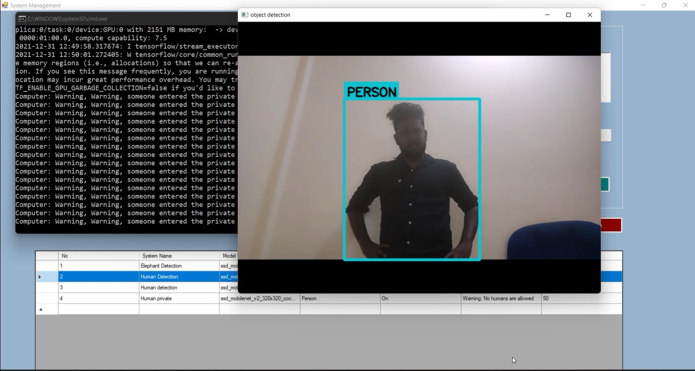

# Introduction to Object Detection Alerting System

Object detection is a computer technology related to computer vision and image processing that deals with detecting instances of semantic objects of a certain class in digital images and videos.

This software application is used to create an alerting or a warning systems for certain objects. It is using an object detection model that was trained with coco-2017 dataset. (Pre-Trained model of Google TensorFlow). There are 80 objects (labels) are available within this model. Those can be used to customize and develop alerting and warning system via configuring the pipeline.

For an example, If we want to build an elephant detection system with alarming, we can simply configure a system with it. Likewise, If we want to build a human detection system with alarming for private areas, we can simply customize a system with it.

From the object list, we can choose that what are objects to be detected and do we want the alarming and etc.     

## Technical Information

This object detection alerting system is developed with Python and C#. Python is responsible for the computer vision related operations. TensorFlow and OpenCV are the main framework of this project. TensorFlow is used to handle logic behind model loading, manipulation and etc. OpenCV is used to handle vision related tasks such as video plotting, drawing rectangles and etc.  


C# is responsible for management panel and the user interface of this system. It changes the behaviours of object detection by adjusting parameters.


#### Programming Languages & Frameworks
- Python
- C#
- SQLITE
- OpenCV
- Argparse
- Playsound
- Pyttsx3
- TensorFlow
- Protobuf
- TensorFlow Object Detection Framework


#### Technical Requirements

- Python 3.8
- .NET Framework 4.7.2

## Configuration & Setup

This project supports CPU and GPU environments to run. If your computer has a GPU (Graphics Processing Unit) with CUDA-Enabled, You can setup a GPU-TensorFlow version to run this application much faster.

If you don't have a GPU, you can still install this application with CPU-TensorFlow version. However, the processing speed with CPU is much slower than the processing on GPU.

If your computer has a GPU, you need to install CUDA & CUDDN to enable the GPU support for TensorFlow. Installation process of CUDA & CUDDN is a bit tricker than the normal TensorFlow installation.

### 01. Installing CUDA & CUDDN

If your computer has no GPU, You should skip this installation, you can run this application with CPU. However, It will be much slower. If your computer has a GPU but, you don't like to install CUDA & CUDDN, you can still skip this process. But, this application will only use CPU for tensor processing even though you have a hardware-based GPU. Therefore, CUDA & CUDDN installation process is very essential to enable the GPU support for computer that a GPU.

Note: If your computer has no GPU, You shouldn't install CUDA & CUDDN. You can skip this installation and go ahead with next step.


#### Checking suitable CUDA & CUDDN verions for TensorFlow.

Check Here:- [https://www.tensorflow.org/install/source#gpu](https://www.tensorflow.org/install/source#gpu)


We are going to install TensorFlow (V 2.7.0), Therefore, we need to install CUDA (V 8.1) and CUDDN (V 11.2) according to the chart above.

First, we need to install CUDA (V 8.1) then, we should install CUDDN (V 11.2) for the TensorFlow (V 2.7.0).

The above chart clearly explains which CUDA & CUDDN versions that we should install for the selected TensorFlow.


#### Installing CUDA

Download CUDA From Here:- [https://developer.nvidia.com/cuda-toolkit-archive](https://developer.nvidia.com/cuda-toolkit-archive)


Download & Install the appropriate CUDA version from the official website of NVIDIA.The installation process is simple, we can install it with the GUI installer.


#### Installing CUDDN
Download CUDDN From Here:- [https://developer.nvidia.com/rdp/cudnn-archive](https://developer.nvidia.com/rdp/cudnn-archive)


Download & Install the appropriate CUDDN version from the official website of NVIDIA.This time, the installation process is bit tricky.

01.Download and Extract CUDDN zip.

02.There are 3 following folders in it.
 * bin
 * include
 * lib

03.Open the CUDA Installation directory (WHERE is the CUDA installed) Ex: (C:\Program Files\NVIDIA GPU Computing Toolkit\CUDA\v11.2)


04.Copy all content from bin, include, lib folder from the extracted CUDDN zip to the installed CUDA directory's bin, include, lib. An example is shown above.

#### Add CUDA & CUDDN Path to the environment variable.

After that installation of CUDA & CUDDN, we need to add the path to the environment variable. Go to PC settings and add them. If you don't know how to add them, just google it.

01.We need to add the following path.

 * Bin Path
 * Libnvp Path

 C:\Program Files\NVIDIA GPU Computing Toolkit\CUDA\v10.2\bin

 C:\Program Files\NVIDIA GPU Computing Toolkit\CUDA\v10.2\libnvvp\


Note: Make sure to add the correct path.


#### Check CUDA & CUDDN installed successfully.

- Open CMD and Type

  ```
    nvidia-smi
  ```


If it shows like above, that means you have successfully installed CUDA in your computer.

### 02. Installing TensorFlow

Now, It's time to install TensorFlow. It is simple now. Just open CMD and type following command, that will install TensorFlow for both environments including GPU.

Note: If your computer does not have a GPU, You can still install it. It will only install the CPU version, if it does not find CUDA & CUDDN.

- Installing TensorFlow

  ```
    pip install tensorflow
  ```

To check whether this installed TensorFlow utilize the GPU. Open python interpreter and write following code. It will show the GPU memory.  


- Check TensorFlow uses GPU
  ```
  import tensorflow as tf
  print(tf.test.gpu_device_name())
  ```


Note: If your computer does not have a GPU, you need to check it. You can simply skip everything, including CUDA & CUDDN installation and only install "pip install tensorflow" and go ahead with the next step.

### 03. Installing Object Detection Framework

In order to install the object detection framework, clone the following repository. This repo contains Google Research of TensorFlow and Object Detection essential Contents.

Clone this Google models repository:- [https://github.com/tensorflow/models](https://github.com/tensorflow/models)

This repo is large (700MB). it contains almost all files of the TensorFlow and Google Object Detection Framework researches, we should install it manually to utilize the object detection framework.

- Clone models repo

  ```
    git clone https://github.com/tensorflow/models.git
  ```


Now, we have to download Protobuf to convert the serialize structured data.


Download Protobuf:- [https://github.com/protocolbuffers/protobuf/releases](https://github.com/protocolbuffers/protobuf/releases)

01.Extract it.

02.Copy the protoc.exe and paste it under the cloned repo (models/research) folder.


- From models/research folder, Execute the following code in CMD

  ```
    protoc object_detection/protos/*.proto --python_out=.
  ```

03.To install the object detection manually, copy the setup.py that is under (models/research/object_detection/packages/tf2/setup.py) and paste in the (models/research) folder.


- Install object detection manually from (models/research).

  ```
    pip install -e .
  ```

04.After the installation, we don't need the cloned models repo anymore.

### 04. Installing Other Frameworks


- Installing TF-Slim

  ```
    pip install tf-slim
  ```

- Installing tf-models-official

  ```
    pip install tf-models-official
  ```

- Installing Mediapipe

  ```
    pip install mediapipe
  ```

- Installing Opencv

  ```
    pip install opencv-python
  ```

- Installing Playsound

  ```
    pip install playsound
  ```

- Installing Pyttsx3

  ```
    pip install pyttsx3
  ```


Note: If you encounter any module missing issue, just try with "pip install MODULENAME", if it does not work try search on Google for answers.

### Running Object Detection Alerting System

Now, it's time to run our app. We have installed all of the important frameworks. If you find any issues on installation, it's better to do a Google search.

- Clone the repo

```
  git clone https://github.com/GunarakulanGunaretnam/object-detection-alerting-system.git
```

#### Start the program

```
  Execute the (object-detection-alerting-system.exe) that is found under "object-detection-alerting-system\project-files\object-detection-alerting-system\bin\Debug"
```





## Social Links

* [Linkedin Profile](https://www.linkedin.com/in/gunarakulangunaretnam)
* [Facebook Profile](https://www.facebook.com/gunarakulangr.page)
* [Instagram Profile](https://www.instagram.com/gunarakulangunaretnam)
* [Twitter Profile ](https://twitter.com/gunarakulangr)
* [Kaggle Profile](https://www.kaggle.com/gunarakulangr)
* [TikTok Profile](https://www.tiktok.com/@gunarakulangunaretnam)
* [Youtube Profile](https://www.youtube.com/channel/UCMWkED5sabgVZSCKjZuRJXA)
